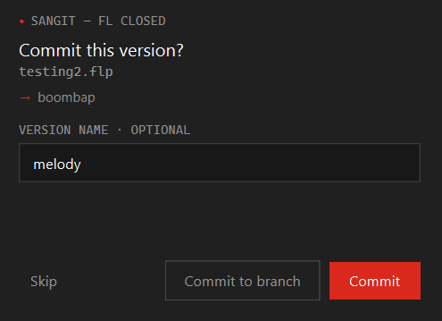
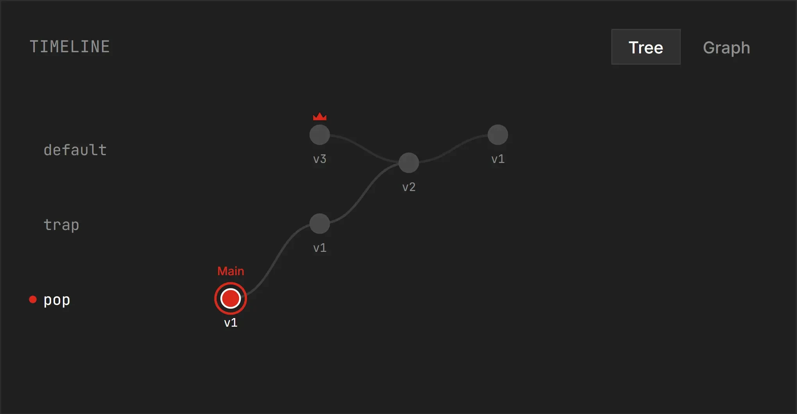
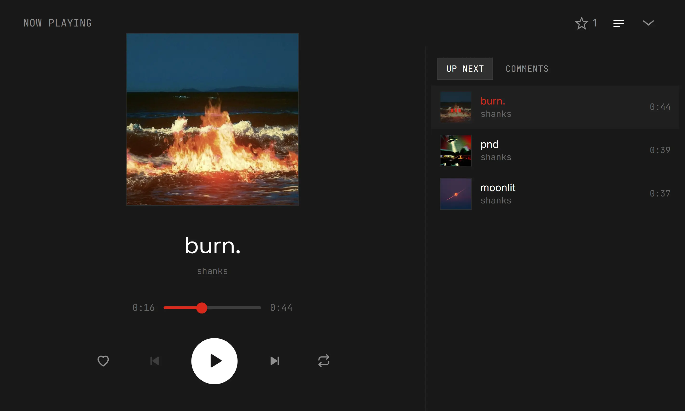
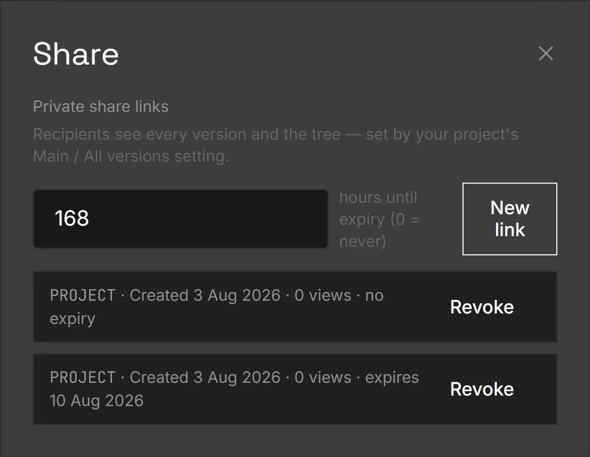

<div align="center">

# SanGit

**Version control for music, built on the premise that music doesn't converge.**

[**Live app →**](https://san-git.vercel.app) · [Download the tray app](https://github.com/sha-shanks300/SanGit/releases/latest) · [Source-available, not open source](#licence)

</div>

---

## The idea

Version control was invented for **code**, where branching exists to **converge**. You fork, build a feature, merge it back, delete the branch. A branch that never merges is debt.

**Music doesn't work like that.** You cannot fuse two arrangements into one, and you would never want to. A branch in music is a road you may never walk back down — a different chorus, a half-time flip, a version for another vocalist. Same tree, opposite physics.

Two things people conflate, which SanGit keeps apart:

|  | Code | Music |
|---|---|---|
| A branch is… | a detour meant to come back | a road that may never come back |
| The goal is… | converge | diverge |
| Merging two lines | essential | meaningless — one take just wins |
| Returning to an old point | rare | constant |
| Old branches | pruned as debt | hoarded; any save might be the one |
| "The main one" is… | a branch you march toward | a **star that floats to any node** |

That last row is the whole design. Because the winner can be any save on any line — and you usually don't know which until much later — "the main song" can't be a privileged branch. It's a marker that lands anywhere in the tree and moves whenever you change your mind. The branch list is just filing. The tree plus the movable star is the product.

---

## What it does

You keep working in FL Studio exactly as you already do. A tray app watches your project folder, and when you close FL Studio it asks whether to keep the session.



Approve it and the `.flp` is snapshotted and uploaded immediately. The mp3 render is queued and runs **after FL Studio closes** — FL's command-line renderer isn't headless, so it can't run alongside your session. The version appears on the web timeline as *processing* within a second, then flips to playable when the audio lands.

### Every save becomes a node you can hear



Two views of the same history — a deterministic SVG tree, and an Obsidian-style force-directed graph where dragging a node springs it back into ancestry order. Ancestry is recorded at commit time, not guessed from timestamps.

### The player follows you



One `<audio>` element lives above the whole app, so playback survives navigation. Hover-play a project from a profile, click through to the tree, keep listening. Every version is likeable and commentable individually — per-version feedback is the point, not a single polished track.

### Sharing that you can take back



Public pages for the world, or private links that expire and can be revoked. All audio is served through short-lived signed URLs from private storage buckets — which is what makes revocation actually mean something, rather than being a link you hope nobody saved.

---

## How it's built

Three parts:

| | |
|---|---|
| **`apps/web/`** | Next.js 16 (App Router) + Supabase — dashboard, version tree and graph, player, likes/comments, share links. Deployed on Vercel. |
| **`service/`** | Python + PySide6 tray app for Windows — save detection, commit prompt, upload queue, mp3 render queue. Ships as an Inno Setup installer. |
| **`supabase/`** | Postgres migrations: schema, row-level security, storage buckets. |

```
FL Studio save → watcher (debounced) → commit prompt → snapshot .flp
  → POST /api/ingest/init-upload      [upserts project + branch, dedupes by hash]
  → PUT .flp straight to Supabase Storage (presigned)
  → POST /api/ingest/complete         [version row, render_status=pending]
       … the timeline shows the node as "processing" instantly, over Realtime
  → FL Studio closes → FL64.exe /R /Emp3 renders the snapshot
  → PUT .mp3 (presigned) → POST /api/ingest/audio/:id
       … node flips to playable
```

A few decisions that shape most of the code:

- **Uploads never touch the web server.** Vercel caps request bodies at 4.5 MB and `.flp` files blow past that, so the API hands out presigned Storage URLs and the tray app uploads directly.
- **Every version carries its own parent**, written at commit time. Single-parent by design — a merge would need two, and merges don't exist here. Deleting a mid-chain version reparents its children onto their grandparent, so the map never loses a road.
- **Playback is always signed URLs from private buckets.** No public audio URLs anywhere. This is the mechanism that makes expiring share links enforceable.
- **RLS on every table.** Private share links can't be seen by row-level security, so token-scoped routes validate the token and write through an admin client rather than loosening the policies.
- **Renders wait for you to finish.** FL's renderer opens the GUI, so jobs queue until your session ends and then run unattended.

Design system: `apps/web/DESIGN.md` — a Ferrari-derived cinematic dark theme. Sharp corners everywhere, hairline borders instead of shadows, one scarce Rosso Corsa accent, display type never bold.

---

## Running it

The public app is at **[san-git.vercel.app](https://san-git.vercel.app)** and the tray app is on the [releases page](https://github.com/sha-shanks300/SanGit/releases/latest). Setup instructions for a local development copy are in [`docs/SETUP.md`](docs/SETUP.md).

Note that running your own instance requires permission — see below.

---

## Licence

**Source-available, not open source.** The code is public so you can read it, evaluate it, and see how it was built. It is not licensed for use.

You may read the source and the commit history, and quote short excerpts with attribution. You may not run, deploy, copy, modify or redistribute it, or present it as your own work, without written permission. Full terms in [LICENSE](LICENSE).

If you want to use part of this, or run an instance, open an issue — the answer may well be yes.

---

<div align="center">

Built by [**@sha-shanks300**](https://github.com/sha-shanks300) — a producer who got tired of `final_FINAL_v3.flp`.

</div>
